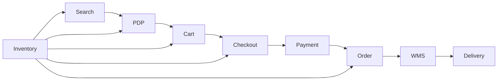

# Inventory Management Quality Engineering Knowledge Base

## Executive Summary

This knowledge base explains how inventory quality affects the end-to-end customer journey in a large-scale e-commerce platform.

It focuses on business rules, system dependencies, quality risks, test strategy, production metrics, and release readiness from a Staff QA Engineer perspective.

## Business Goal

The Inventory domain ensures that customers can purchase only products that are actually available.

Accurate inventory information helps prevent:

- Overselling
- Order cancellation
- Payment and order inconsistencies
- Customer dissatisfaction
- Revenue loss

## Purpose

This knowledge base provides QA Engineers, Software Engineers, and Product Managers with a shared reference for understanding and improving inventory quality.

## Scope

Included:

- Inventory visibility across the customer journey
- Inventory reservation and deduction
- Inventory restoration
- Cross-system synchronization
- Concurrency and overselling
- API and E2E validation
- Production monitoring
- Release readiness

Excluded:

- Detailed warehouse operating procedures
- Physical stock-counting processes
- Internal implementation details not required for quality analysis

## Customer Journey Impact

## Knowledge Base

1. [Business Overview](docs/01-business-overview.md)
2. [Business Rules](docs/02-business-rules.md)
3. [System Workflow](docs/03-system-workflow.md)
4. [Quality Risks](docs/04-quality-risks.md)
5. [Test Strategy](docs/05-test-strategy.md)
6. [Test Scenarios](docs/06-test-scenarios.md)
7. [Quality Metrics](docs/07-quality-metrics.md)
8. [Release Readiness](docs/08-release-readiness.md)

## Staff QA Perspective

The goal is not to test every inventory scenario equally.

Testing depth should be prioritized based on customer impact, revenue risk, data consistency, concurrency, and recoverability.
