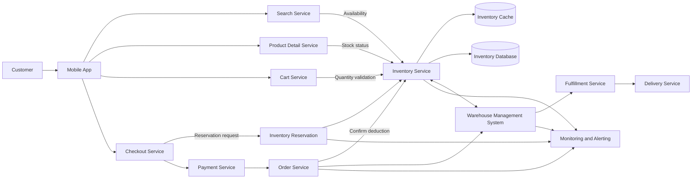

# Inventory System Architecture

## Purpose

This diagram shows the major systems that read, reserve, update, and synchronize inventory across the customer purchase journey.

## QA Focus

- Validate inventory consistency across Search, PDP, Cart, Checkout, and Order.
- Verify cache and database synchronization.
- Confirm that WMS updates propagate to customer-facing systems.
- Monitor failures, latency, and inventory mismatches.