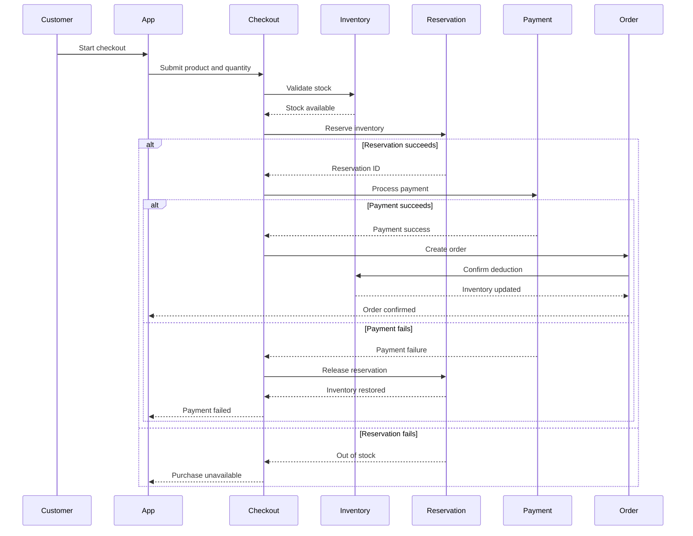

# Purchase and Inventory Workflow

## Purpose

This sequence shows how inventory is validated, reserved, deducted, or restored during checkout.

## QA Focus

- Revalidate inventory before payment.
- Confirm that reservation happens only once.
- Verify inventory restoration after payment failure.
- Ensure successful orders deduct inventory exactly once.
- Validate safe behavior for duplicate requests.