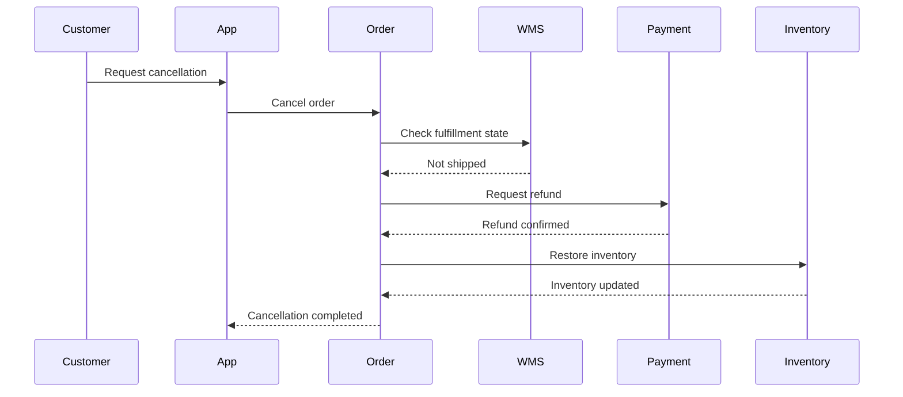

# Order Cancellation and Inventory Restoration

## Purpose

This sequence shows inventory restoration when an eligible order is cancelled before shipment.

## QA Focus

- Verify cancellation eligibility by order state.
- Confirm inventory is restored only after the required business conditions are met.
- Prevent duplicate inventory restoration.
- Validate consistency among cancellation, refund, and inventory states.