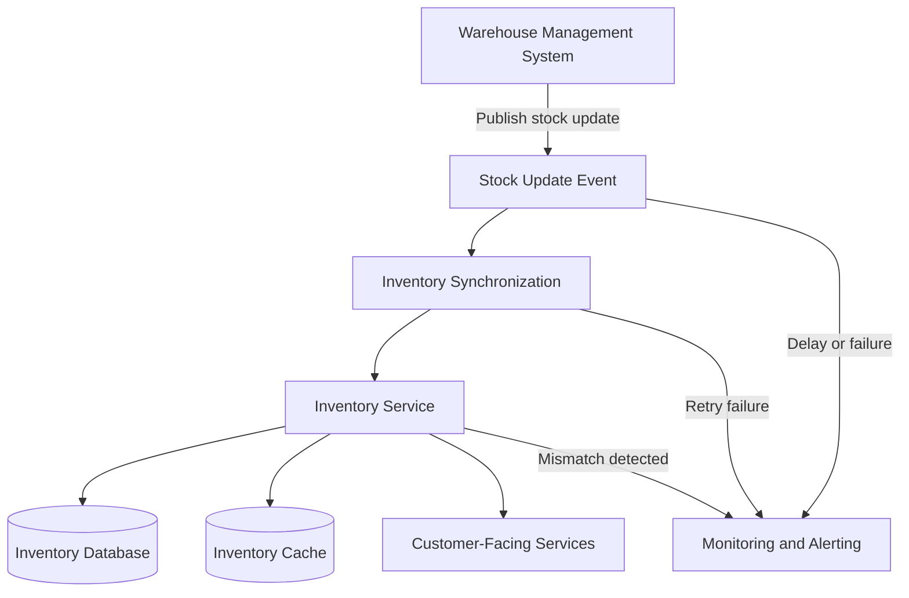

# Inventory and WMS Synchronization

## Purpose

This diagram shows how physical warehouse stock updates reach customer-facing inventory systems.

## QA Focus

- Measure synchronization latency.
- Verify duplicate events do not update stock multiple times.
- Validate retry and recovery behavior.
- Confirm database, cache, and UI converge to the same state.
- Ensure delays and mismatches trigger monitoring alerts.