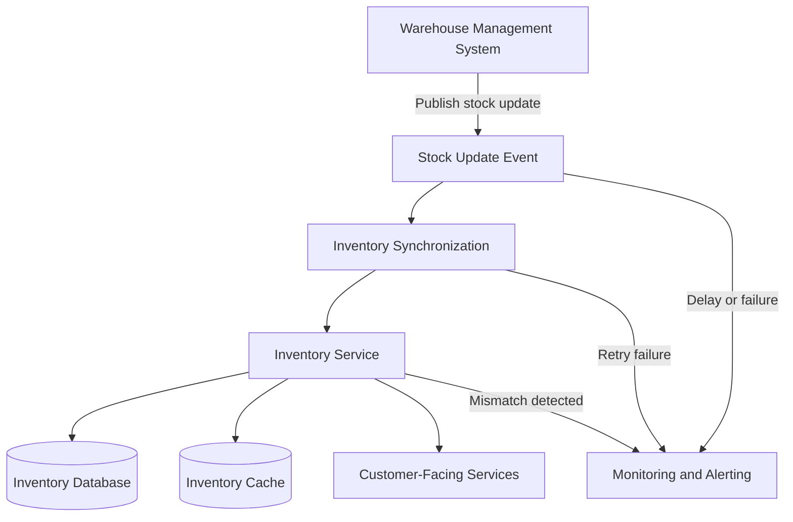

# Inventory and WMS Synchronization

```mermaid
flowchart TD
    WMS[Warehouse Management System]
    Event[Stock Update Event]
    Sync[Inventory Synchronization]
    Inventory[Inventory Service]
    DB[(Inventory Database)]
    Cache[(Inventory Cache)]
    CustomerUI[Customer-Facing Services]
    Alert[Monitoring and Alerting]

    WMS -->|Publish stock update| Event
    Event --> Sync
    Sync --> Inventory
    Inventory --> DB
    Inventory --> Cache
    Inventory --> CustomerUI

    Event -->|Delay or failure| Alert
    Sync -->|Retry failure| Alert
    Inventory -->|Mismatch detected| Alert
```