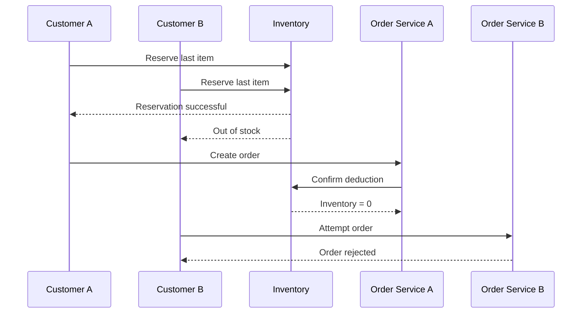

# Concurrent Purchase of the Last Item

## Purpose

This sequence represents two customers attempting to purchase the final available unit.

## Expected Result

- Only one reservation succeeds.
- Only one order is created.
- Final inventory is zero.
- No duplicate payment or deduction occurs.
- The unsuccessful customer receives a clear out-of-stock response.

## QA Focus

- Execute concurrent requests against the same stock item.
- Validate order, payment, reservation, and inventory records together.
- Confirm inventory never becomes negative.
- Repeat the test under higher load to identify race conditions.