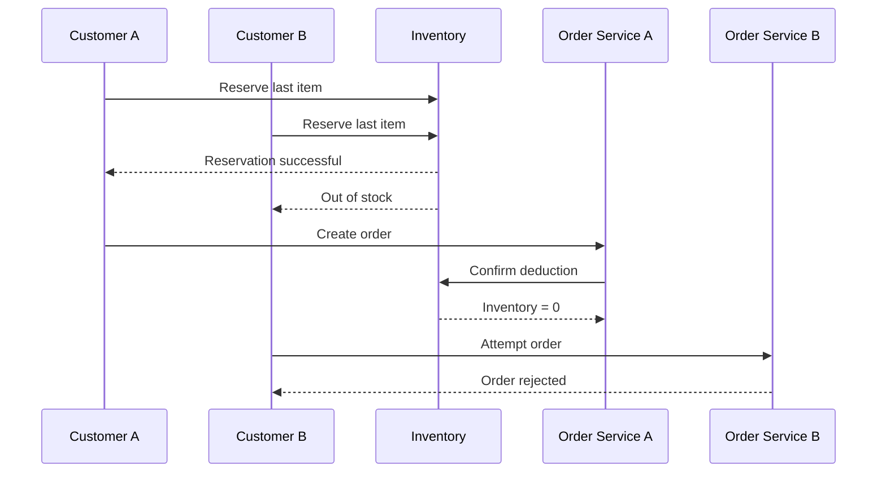

# Concurrent Purchase of the Last Item

```mermaid
sequenceDiagram
    participant UserA as Customer A
    participant UserB as Customer B
    participant Inventory
    participant OrderA as Order Service A
    participant OrderB as Order Service B

    UserA->>Inventory: Reserve last item
    UserB->>Inventory: Reserve last item

    Inventory-->>UserA: Reservation successful
    Inventory-->>UserB: Out of stock

    UserA->>OrderA: Create order
    OrderA->>Inventory: Confirm deduction
    Inventory-->>OrderA: Inventory = 0

    UserB->>OrderB: Attempt order
    OrderB-->>UserB: Order rejected
```