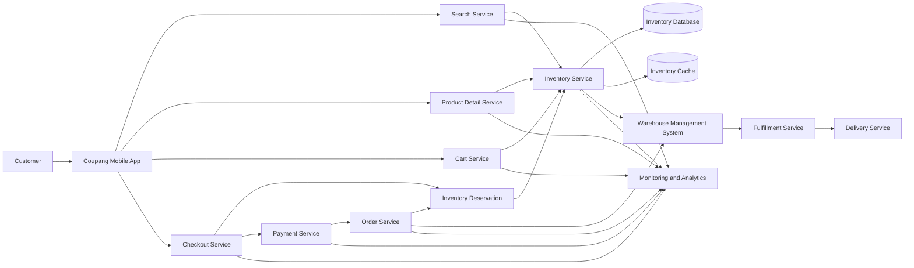
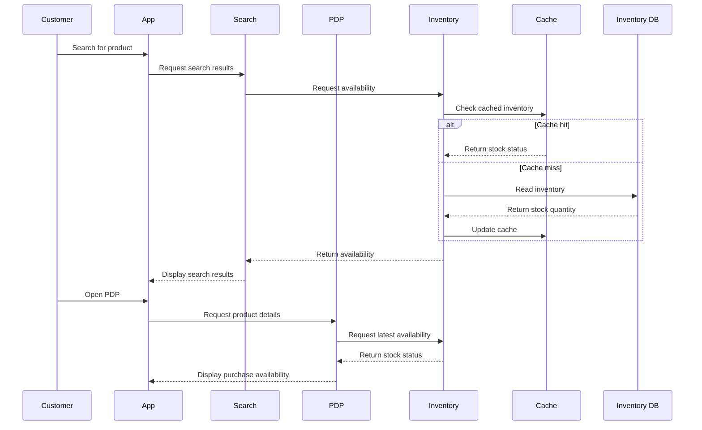
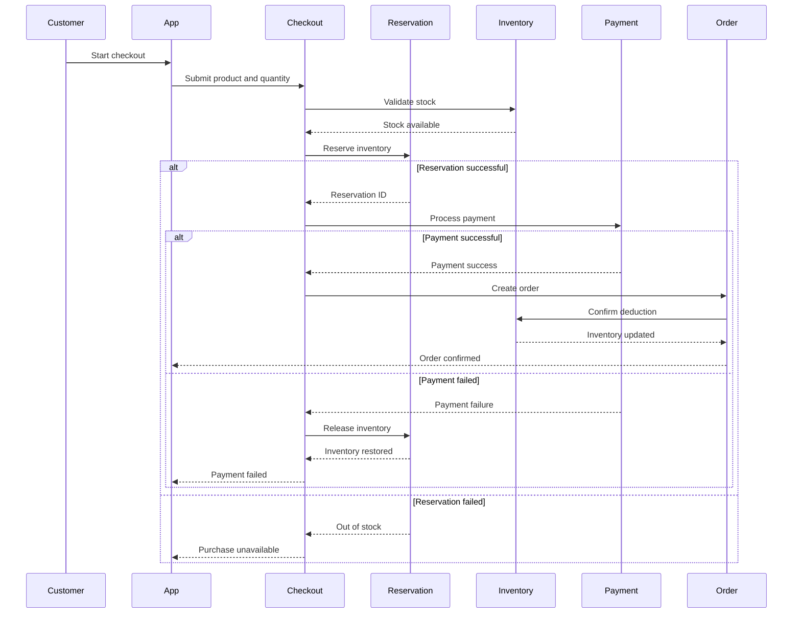
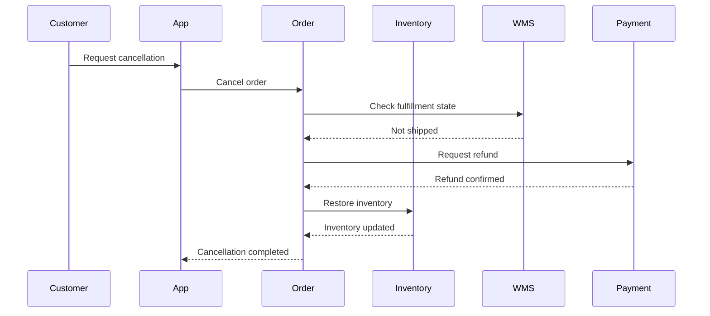
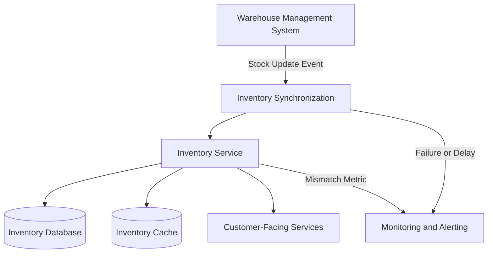
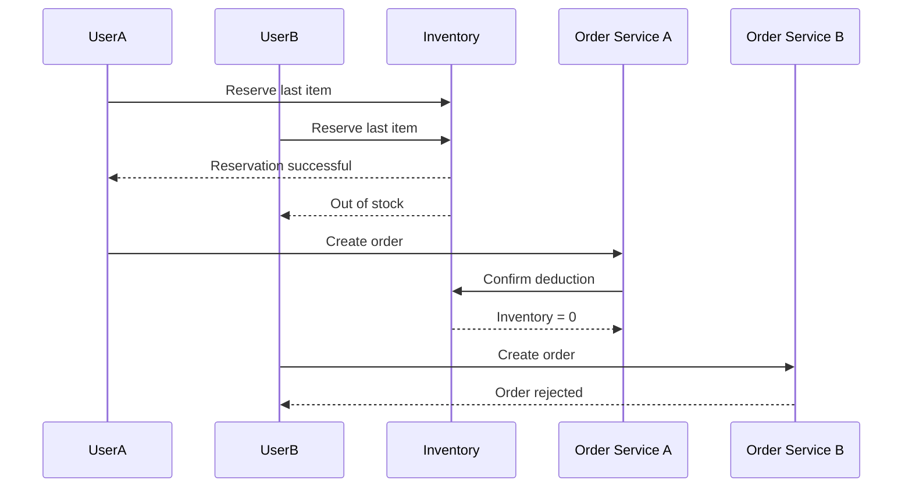

# System Workflow

## Purpose

Inventory is connected to multiple systems across the customer purchase journey.

This document explains how inventory data is exchanged between customer-facing applications, commerce services, warehouse systems, and operational systems.

The goal is to help QA engineers identify integration risks, synchronization issues, and failure points across the end-to-end workflow.

---

## Inventory System Architecture

---

## Core Inventory Components

| Component | Responsibility |
|---|---|
| Mobile App | Displays inventory availability to the customer |
| Search Service | Uses inventory status to determine product visibility |
| Product Detail Service | Displays current stock and purchase availability |
| Cart Service | Validates whether selected products are still available |
| Checkout Service | Revalidates inventory before payment |
| Inventory Reservation | Temporarily reserves stock during purchase |
| Payment Service | Processes payment before final order confirmation |
| Order Service | Creates the order and confirms inventory deduction |
| Inventory Service | Provides inventory availability and updates stock |
| Inventory Database | Stores authoritative inventory data |
| Inventory Cache | Provides faster inventory reads |
| WMS | Manages physical warehouse stock and fulfillment updates |
| Fulfillment Service | Coordinates warehouse processing |
| Delivery Service | Handles delivery after fulfillment |
| Monitoring | Detects inventory mismatches, failures, and latency |

---

## Inventory Read Workflow

The inventory read workflow is used when customers browse products before purchase.

### QA Focus

- Search and PDP should show consistent inventory status.
- Cache must not expose stale stock for an unacceptable duration.
- Out-of-stock products must follow the defined visibility policy.
- API responses should contain the correct product and option identifiers.

---

## Purchase and Reservation Workflow

Inventory should be revalidated and reserved during checkout.

### QA Focus

- Inventory must be revalidated before payment.
- Reservation should succeed only when stock is available.
- Payment failure must release the reservation.
- Successful orders must deduct inventory only once.
- Duplicate requests must not create duplicate reservations or deductions.

---

## Order Cancellation Workflow

Cancelled orders may require inventory restoration depending on the order state and business policy.

### QA Focus

- Inventory restoration should depend on the cancellation policy.
- Inventory must not be restored twice.
- Cancellation, refund, and inventory states must remain consistent.
- Shipped or partially fulfilled orders may require different handling.

---

## Inventory Synchronization with WMS

The system inventory and physical warehouse inventory must remain aligned.

### QA Focus

- WMS updates should propagate within the accepted synchronization time.
- Duplicate events must not deduct inventory multiple times.
- Delayed or missing events should trigger retries or alerts.
- Inventory Database, cache, and customer-facing services should converge to the same state.

---

## Concurrent Purchase Workflow

When the last item is purchased by multiple customers, only one order should succeed.

### Expected Result

- One reservation succeeds.
- One order is created.
- The final inventory is zero.
- The unsuccessful customer receives a clear out-of-stock message.
- No duplicate payment or order is created.

---

## High-Risk Integration Points

| Integration | Main Risk | Customer Impact |
|---|---|---|
| Search ↔ Inventory | Incorrect product visibility | Customer sees unavailable products |
| PDP ↔ Inventory | Stale stock information | Purchase failure later in the journey |
| Cart ↔ Inventory | Invalid quantity or stale stock | Cart inconsistency |
| Checkout ↔ Reservation | Reservation failure | Purchase blocked |
| Payment ↔ Reservation | Inventory not released after failure | False out-of-stock |
| Order ↔ Inventory | Duplicate or missing deduction | Overselling or incorrect stock |
| Inventory ↔ Cache | Stale cached data | Inconsistent UI |
| Inventory ↔ WMS | Physical/system mismatch | Order cancellation |
| Cancellation ↔ Inventory | Failed or duplicate restoration | Incorrect availability |

---

## Failure Scenarios

### Inventory Service Timeout

Expected behavior:

- Unsafe purchase actions should be blocked.
- The customer should receive a recoverable error message.
- Retry behavior should follow the business policy.
- The failure should be logged and monitored.

### Cache Contains Stale Inventory

Expected behavior:

- Critical purchase stages should revalidate against the authoritative source.
- Stale inventory should not cause overselling.
- Cache refresh or invalidation should occur after inventory updates.

### WMS Synchronization Delay

Expected behavior:

- The system should identify delayed updates.
- Monitoring should detect synchronization latency.
- Customer-facing availability should follow the defined consistency policy.

### Duplicate Inventory Update

Expected behavior:

- The same order or event should not deduct inventory more than once.
- Duplicate processing should be safely ignored or handled idempotently.

---

## Staff QA Perspective

Inventory quality is determined by the consistency of data across services, not by the correctness of one screen or one API.

A Staff QA Engineer should focus on:

- system boundaries,
- data ownership,
- synchronization behavior,
- concurrency,
- failure recovery,
- observability,
- and customer impact.

Testing should validate the complete workflow from product discovery to order creation, cancellation, warehouse processing, and delivery.
