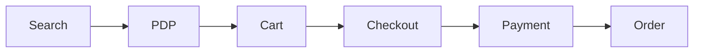

# Quality Metrics

## Purpose

Inventory quality should be measured using customer-facing, operational, and technical indicators.

The goal is to detect inventory issues early, understand their business impact, and continuously improve the customer purchase experience.

---

## Core Quality Metrics

| Metric | Definition | Why It Matters |
|---|---|---|
| Inventory Accuracy | Percentage of system inventory values matching the authoritative stock source | Prevents overselling and false out-of-stock conditions |
| Overselling Rate | Percentage of orders accepted when inventory was not actually available | Directly impacts cancellations, refunds, and customer trust |
| Stock Update Latency | Time required for inventory changes to propagate across systems | Measures synchronization speed |
| Reservation Success Rate | Percentage of valid reservation requests completed successfully | Indicates checkout reliability |
| Reservation Release Success Rate | Percentage of failed or cancelled orders that correctly release reserved stock | Prevents false out-of-stock conditions |
| Inventory API Success Rate | Percentage of successful inventory API responses | Measures service reliability |
| Inventory API Latency | Response time of inventory-related APIs | Affects Search, PDP, Cart, and Checkout performance |
| Cross-Service Consistency Rate | Percentage of cases where Search, PDP, Cart, Checkout, and Order show the same stock state | Measures end-to-end consistency |
| WMS Synchronization Success Rate | Percentage of warehouse updates successfully reflected in commerce systems | Prevents physical and system stock mismatch |
| Inventory-Related Cancellation Rate | Percentage of orders cancelled due to inventory issues | Direct customer and revenue impact |
| Customer Complaint Rate | Number of inventory-related customer contacts or complaints | Reflects customer experience impact |

---

## Customer Journey Metrics

Inventory quality should be evaluated across the customer purchase funnel.

Recommended funnel checks:

- Search-to-PDP availability consistency
- PDP-to-Cart stock consistency
- Cart-to-Checkout reservation success
- Payment-to-Order inventory confirmation
- Order-to-WMS synchronization success

---

## Alert Conditions

Alerts should be configured when:

- Overselling rate exceeds the agreed threshold
- Inventory API error rate increases unexpectedly
- Stock update latency exceeds the service-level objective
- Reservation failures spike
- Inventory restoration failures occur
- WMS synchronization delay increases
- Inventory-related cancellations increase
- Customer complaints rise after a release

---

## Reporting

Quality reports should include:

- Current metric values
- Trend compared with the previous release
- Top affected products or categories
- Customer and revenue impact
- Root-cause summary
- Mitigation and follow-up actions

---

## Staff QA Perspective

A Staff QA Engineer should not rely only on test execution results.

Inventory quality should be evaluated through a combination of test evidence, production metrics, customer impact, and operational reliability.

The most important question is not only whether the tests passed, but whether customers can consistently complete purchases without inventory-related failures.

